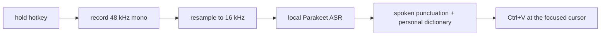

# Parakeet Cage

Push-to-talk dictation for the Linux desktop. Hold a hotkey, speak, release — the transcription
lands in whatever text field currently has focus. Inference is **fully local**: no network calls,
no telemetry, no cloud, no API keys.

Powered by [**Moondream Parakeet Redux**](https://huggingface.co/moondream/parakeet-redux), a
178 MB 1.58-bit (ternary) ASR model that fits in memory and runs on the CPU.



## Features

- **Push-to-talk** global hotkey, rebindable from the tray menu.
- **Fully offline** ASR — the model is loaded from local weights, HuggingFace telemetry and
  remote snapshot checks are disabled in-process.
- **25 languages** detected automatically by the model.
- **Tray status icon**: green = idle, red = recording, amber = transcribing.
- **Works on Wayland, including native Wayland clients** — text is injected through the
  `xdg-desktop-portal` RemoteDesktop virtual keyboard, with `wtype`, `xdotool` and `pynput`
  fallbacks. See [Text injection](#text-injection).
- **Clipboard friendly**: your previous clipboard is restored after a successful paste, and if the
  keystroke cannot be delivered the transcription is deliberately *left on the clipboard* so you
  can paste it by hand.
- **GTK3 settings dialog** for hotkeys (interactive capture, `Esc` to cancel) and the input device.
- **Spoken punctuation**: say "question mark", "comma", "new paragraph" and the symbol is typed —
  the model's own punctuation around the command is cleaned up rather than doubled.
- **Personal dictionary**: teach it the names and jargon it keeps mishearing. Fuzzy matches apply
  only to words the model does *not* know well, so "our" is never rewritten into "OAuth"; blocked
  guesses are queued for review instead. Undo is one click away in the tray.
- CPU inference, single process, no persistent window.

## Requirements

| Component | Notes |
|---|---|
| Linux | X11 or Wayland. Developed and tested on Fedora 44 / KDE Plasma 6.7 Wayland. |
| Python | 3.11 or newer (`tomllib`); 3.14 tested. |
| GTK 3 + PyGObject | tray icon and settings dialog |
| dbus-python | KDE Klipper clipboard access and the portal virtual keyboard |
| sounddevice / PortAudio | microphone capture |
| `wl-clipboard` (`wl-copy`/`wl-paste`) | clipboard on Wayland (or Klipper via D-Bus) |
| `xdg-desktop-portal` (with RemoteDesktop support) | keystroke injection on Wayland |
| Model weights | ~178 MB, see below |

## Install

### From source

```bash
git clone git@github.com:craigmcgrain-spec/Parakeet-Cage.git
cd Parakeet-Cage

# system packages (Fedora)
sudo dnf install python3-gobject gtk3 dbus-python wl-clipboard

# python dependencies + console script
pip install -e .
```

### Model weights

The app **never downloads anything**. Fetch the weights once and place them in any of these
locations (the first match wins, project directory first):

1. the path in your config (`[model] path`), e.g. `models/parakeet-redux`
2. `~/.local/share/parakeet-cage/models/parakeet-redux` (or `$XDG_DATA_HOME/...`)
3. `~/.cache/huggingface/hub/models--moondream--parakeet-redux/snapshots/<rev>`

A valid model directory contains `model.safetensors`, `config.json` and `tokenizer.json`.

```bash
pip install huggingface_hub
hf download moondream/parakeet-redux --local-dir models/parakeet-redux
```

### AppImage

```bash
./packaging/build_appimage.sh          # -> dist/Parakeet-Cage-<version>-x86_64.AppImage
chmod +x dist/Parakeet-Cage-1.0.0-x86_64.AppImage
./dist/Parakeet-Cage-1.0.0-x86_64.AppImage
```

The AppImage bundles the application and the model weights; it uses the host's Python 3, PyGObject
and dbus-python (see [AppImage packaging](#appimage-packaging)).

## Usage

```bash
parakeet-cage          # start the daemon (tray icon + global hotkeys)
```

1. Focus the text field you want to dictate into.
2. **Hold** the record hotkey (default `F9`), speak, **release**.
3. The tray turns amber while the model runs, then the text appears at your cursor.
4. `Shift+F9` (configurable) or the tray menu quits the app.

Watch the tray icon: it is the primary status display. Run the daemon from a terminal to see logs.

### Default hotkeys

| Action | Default | Config key |
|---|---|---|
| Push-to-talk (hold) | `F9` | `hotkeys.record` |
| Quit | `Ctrl+Shift+Q` | `hotkeys.quit` |

Hotkeys are parsed by `parakeet_cage/hotkey.py` and grabbed on the X display (Xwayland on Wayland
sessions). On KWin the grab fires regardless of which client has focus; compositors that do not
forward X11 grabs to focused native Wayland windows need a compositor-side binding instead.

## Configuration

`~/.config/parakeet-cage/config.toml` (created by **Settings** in the tray menu):

```toml
[hotkeys]
record = "F9"
quit = "ctrl+shift+q"

[model]
path = "models/parakeet-redux"   # local weights directory, never a download
device = "cpu"

[audio]
device = ""                       # "" = system default input, or a device name/index

[text]
punctuation = true                # spoken commands -> symbols
lexicon = true                    # personal dictionary
lexicon_path = ""                 # "" = ~/.config/parakeet-cage/lexicon.toml
lexicon_max_distance = 2          # edit distance for semi-confident matches

[text.punctuation_extra]          # add commands, or disable one with ""
"winky face" = ";-)"
# period = "!"
```

## Spoken punctuation and your own words

Two stages run on every transcript, before it is pasted. Both are on by default and both can be
switched off in `[text]`.

### Spoken punctuation

Say a command and the symbol is typed: `question mark` → `?`, `period` / `full stop` → `.`,
`comma`, `semicolon`, `colon`, `exclamation mark` / `exclamation point` → `!`, `ellipsis`,
`dash`, `hyphen`, `dot`, `at sign`, `underscore`, `slash`, `backslash`, `plus sign`, brackets,
quotes, `new line`, `new paragraph`. Add your own in `[text.punctuation_extra]`; disable a
built-in one by setting it to `""`.

The model punctuates as it sees fit, so mapping the words is only half the job. Measured real
outputs drive the repair rules:

| The model produces | You get |
|---|---|
| `How are you question mark? See you tomorrow.` | `How are you? See you tomorrow.` |
| `I sent the file period did you get it, question mark.` | `I sent the file. Did you get it?` |
| `Is it Reddy question Mark?` | `Is it Reddy?` (commands match case-insensitively) |
| `wow exclamation mark!` | `wow!` |

Say `literal` before a command to leave it alone: `a literal period of time` stays a period.

### Personal dictionary

`~/.config/parakeet-cage/lexicon.toml` (created for you with the format documented):

```toml
schema_version = 1

[[word]]
word = "kestrel"                  # what gets typed
aliases = ["castrell", "kestral"] # spellings the model produces instead
enabled = true
hits = 0                          # maintained by the app
```

Matching is case-insensitive and whole-word only, and it is deliberately tiered:

| tier | when it applies |
|---|---|
| exact / alias | always |
| edit distance ≤ `lexicon_max_distance` | only when the heard word is *rare* |
| phonetic (consonant skeleton, *exactly* equal) | only when the heard word is *rare* |
| one skeleton edit away, or blocked by the rarity guard | never applied — queued for review |

Rarity is measured with the model's own tokenizer: words it knows cost one or two subword pieces
(`our` 1, `socket` 2) while misheard rare words are spelled out (`castrell` 4, `parakita` 3). That
is what stops `our → OAuth` and `Socket → WebSocket` from corrupting ordinary sentences — those
are written to `~/.local/share/parakeet-cage/learning/pending.toml` for you to confirm instead.
Skeleton *equality* is required for the same reason: `castle` is one skeleton edit from `kestrel`
and was rewritten to it during end-to-end testing, so looser matches are now queued, never applied.

```bash
parakeet-cage --pending        # list queued candidates with how often each was seen
```

Copy the ones you agree with into the lexicon file; the next dictation uses them. After any
transcript was changed, the tray menu offers **Undo last correction**, which re-pastes the
transcript exactly as the model heard it.

Honest limits: a dictionary **cannot** improve recognition on this model — the Parakeet TDT runtime
refuses decoder hints (`"Parakeet TDT does not support an initial prompt"`, and unknown options such
as `hotwords` are rejected), so a word list only rewrites text. On synthetic test speech, 7 of 12
rare/technical words were recovered this way (2 already correct, 2 by edit distance, 3 by
phonetics alone); the rest came back as unrelated real words and need review, not matching.

## How it works

Single Python process, four threads:

| Thread | Role | Module |
|---|---|---|
| Main | tray icon + GLib main loop (also dispatches portal replies) | `tray.py` |
| Hotkey | X11 key grab loop, state machine | `hotkey.py` |
| Audio | `sounddevice` InputStream callback, buffer + resample | `audio.py` |
| ASR | background model warm-up and inference/paste job | `transcriber.py`, `app.py` |

State machine: `IDLE → RECORDING → TRANSCRIBING → IDLE`, driven by key press/release with an
auto-repeat debounce. Presses during `TRANSCRIBING` are ignored.

Audio is captured at the device's native rate (auto-negotiated from a candidate list) as 16-bit
mono and interpolated to exactly 16 kHz before inference; `kestrel`'s Parakeet runtime is fed an
in-memory WAV.

### Text injection

`parakeet_cage/clipboard.py` tries, in order:

| # | Backend | Reaches |
|---|---|---|
| 1 | `xdg-desktop-portal` RemoteDesktop virtual keyboard (`NotifyKeyboardKeycode`, evdev codes) | all Wayland clients, incl. native Wayland — no root, no `/dev/uinput`, no helper binary |
| 2 | `wtype` | compositors implementing `zwp_virtual_keyboard_v1` |
| 3 | `xdotool` | X11 / Xwayland windows |
| 4 | `pynput` (XTest) | X11 only; skipped on Wayland, where it can never reach a native Wayland window |

Backends report success or failure explicitly. If none succeeds, the transcription stays on the
clipboard and an actionable error is logged instead of failing silently.

## Troubleshooting

**Nothing appears at the cursor.** The transcription is on your clipboard (check with `wl-paste`);
an `ERROR` line names the reason. On Wayland you need `xdg-desktop-portal` with RemoteDesktop
keyboard support — verify with:

```bash
busctl --user introspect org.freedesktop.portal.Desktop /org/freedesktop/portal/desktop \
  | grep -E "RemoteDesktop|NotifyKeyboardKeycode"
```

**First dictation is slow (~2 s) and/or asks for permission.** The portal session is created once
per run; afterwards pastes are immediate.

**Hotkey does nothing.** The grab happens on `$DISPLAY` (Xwayland on Wayland). Check the daemon
log for `Registered global record hotkey`; if instead it reports
`Could not register the record hotkey 'F9': the X server refused the grab (BadAccess…)`, another
application already holds that key — usually a second Parakeet Cage instance (the AppImage plus a
source checkout, for example). Only one instance can own a global hotkey, and the second one will
not dictate until the first exits.

**`Local model weights not found`.** Put `model.safetensors` + `config.json` in one of the search
paths above.

**Quit hotkey conflicts.** Release the record hotkey before pressing the quit combination; only one
hotkey is handled at a time.

**A word keeps coming out wrong.** Add it to `~/.config/parakeet-cage/lexicon.toml`
(`word` + the misspelling as an `alias`), or run `parakeet-cage --pending` to see what the app
nearly corrected, and copy the entries you agree with. Run the daemon from a terminal to watch
`Corrected transcript: ...` lines, or disable the stages entirely with `[text] punctuation = false`
/ `lexicon = false`.

**A correction landed that I did not want.** Tray menu → *Undo last correction* re-pastes the
transcript as the model heard it, and the lexicon entry can be deleted or set `enabled = false`.
Every queued guess lives in `pending.toml`; nothing is rewritten without either an exact match or a
rarity-checked fuzzy match.

## Development

```bash
python3 -m pytest -q          # 99 tests
```

| Path | Contents |
|---|---|
| `parakeet_cage/` | application package (config, audio, ASR, hotkeys, clipboard, tray, GTK settings) |
| `tests/` | pytest suite, including a fake-bus portal session harness |
| `packaging/` | AppImage build script and desktop entry |
| `docs/superpowers/` | design spec and implementation plan |

### AppImage packaging

`packaging/build_appimage.sh` builds an AppDir (application code, model weights, attribution files,
desktop entry, generated icon) and runs `appimagetool` (downloaded automatically if absent) to
produce `dist/Parakeet-Cage-<version>-x86_64.AppImage`.

It is a **thin** bundle: Python 3, PyGObject, dbus-python and the pip dependencies come from the
host, because GTK/PyGObject extensions are compiled against the host interpreter and cannot be made
portable by copying them. The spec's "bundle every pip dependency" goal is therefore only partially
met (see `CHANGELOG.md`); the weights themselves *are* bundled, so no model download is needed.

```bash
PARAKEET_BUNDLE_MODEL=0 ./packaging/build_appimage.sh   # small image, model from the search paths
```

## Credits and license

**Parakeet Redux** — the speech model that does the actual work — is by
[Moondream](https://moondream.ai): [`moondream/parakeet-redux`](https://huggingface.co/moondream/parakeet-redux),
licensed **CC-BY-4.0**, a 1.58-bit ternary build of
[NVIDIA's `parakeet-tdt-0.6b-v3`](https://huggingface.co/nvidia/parakeet-tdt-0.6b-v3), run through
Moondream's [kestrel/Photon](https://moondream.ai/photon) inference engine. See
[the release post](https://moondream.ai/blog/introducing-parakeet-redux-and-ultra) and
[CREDITS.md](CREDITS.md) for the full attribution and third-party notices.

Application code is MIT licensed — see [LICENSE](LICENSE). The bundled model weights are **not**
covered by that license; they remain CC-BY-4.0 by Moondream.
